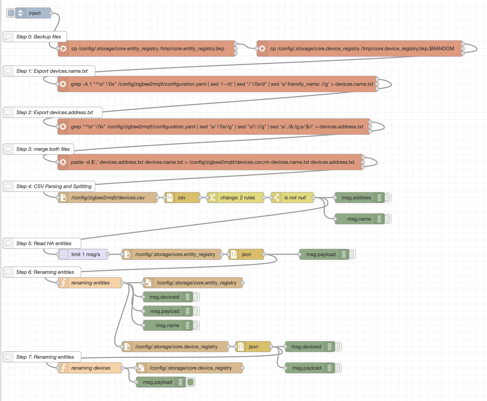
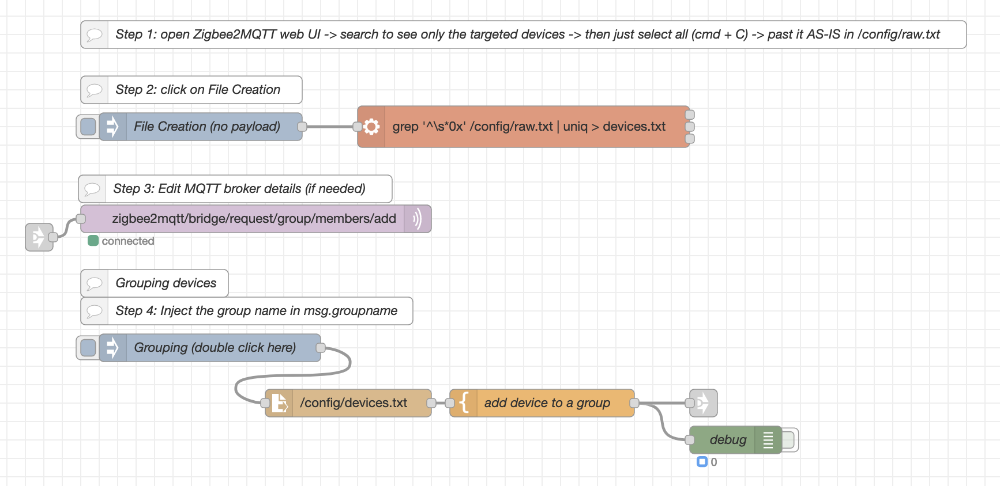
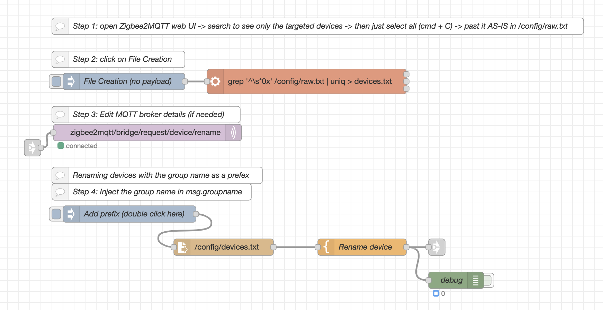
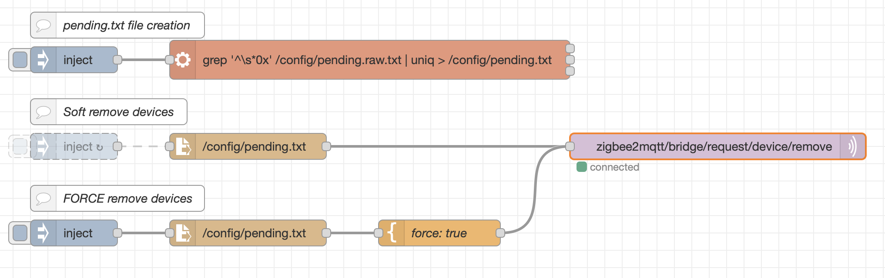

# :: use the flows here at your owm risk ::

How to use it?

Step One: BACKUP!

Step Two: BACKUP!

Step Three: BACKUP!

Step Four: Install Node-RED

Step Five: From the top right corner (let's call it the side menu), click -> import

Step Six: Then copy and past the content of *flows.json*

# Renaming ZHA devices after migration from Zigbee2MQTT

After the migration of Zigbee2MQQTT to Zigbee Home Assistant (ZHA), you will notice that the devices name are not migrated. This is a Node-RED flow to copy the devices name from Zigbee2MQTT to ZHA.

Follow the steps as per the flow's comment

# Regrouping ZHA devices after migration

Add bulk of Zigbee devices to a group

# Adding prefix to ZHA devices after migration

This flow is to add the group name as a prefix.

# Bulk remove devices

This flow is to remove (kick-out) zigbee devices from the network

Step 1: copy the list of devices to remove AS-IS (don't worry how it looks like) into pending.raw.txt in /config folder

Step 2: Click the first injection button to create the pending.txt file

Step 3: Click on the second injection button to remove a zigbee device and make it ready for paring/adoption

Step 4 (BE CARFUL): Click on the third injection button to forcly remove a zigbee device
